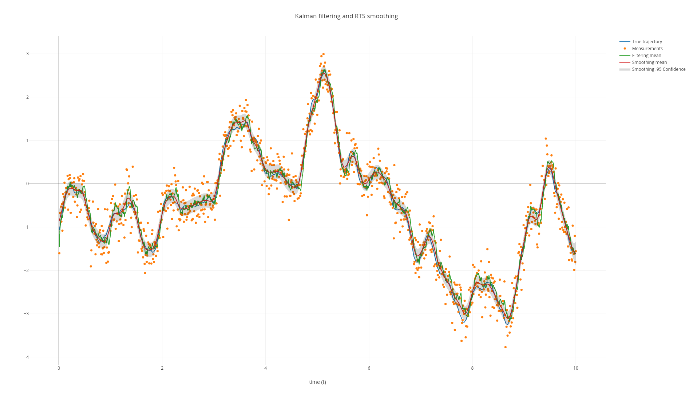

# Kalman filter and RTS smoother in Rust (ndarray)

[](https://github.com/spdes/kalman-rust/actions/workflows/test_run.yml)



This repository features a **simple** Kalman filter and RTS smoother (KFS) implementation in Rust by using the [ndarray](https://github.com/rust-ndarray/ndarray) library.

By **simple**, I mean that the implementation is *not* at its most efficient form not to mention production-ready. It is almost a direct translation of my past Python implementations of KFS, and I tried to keep the syntax here readable for Python/Matlab/Julia users. This means that if you are familar with Python/Matlab/Julia and is interesting to learn Rust, then this implementation would be a good starting example for you.

# Installation and run

The installation guidance of Rust can be found at [this official website](https://www.rust-lang.org/tools/install).

After you have Rust installed, open a terminal and run

```bash
git clone git@github.com:spdes/kalman-rust.git
cd kalman-rust
cargo run
```

If succeeded, you will see a figure generated as in the above. 

If failed, it is very likely that you need to have `openblas` or `Intel MKL` configured in your system and change the `feature` of `ndarray-linalg` in `./Cargo.toml` accordingly.

# Fantastic! I want to learn more about Rust scientific computing!

Welcome to the cult! 

Implementing Kalman filter and RTS smoother is a good exercise to practise a new language, as they involves basic linear algebras, such as matrix algebras and solving linear systems. In light of this, I have an [**article**](https://not.finished.yet) explaining the codes here line-by-line. This article is readable even if you have no experience using Rust.

As a disclaimer, in case that you want to sue me for luring you to learn Rust, please be aware that I do not promise (nor I see any evidence) that Rust would be a main-stream language for scientific computing (especially machine learning) in the future. Furthermore, the learning curve of Rust is very steep. I learnt Rust purely out of hobby and its name [^1]. 

# Benchmarks

In folder `./benchmarks` you may find a few benchmark files written in Rust, Numpy, Jax, Matlab, and Julia to compare their performance on running Kalman filtering and smoothing.

In short, the most important result is that the Rust implementation is evidently better than others when the state dimension is large, and there is still a room to optimise it further!

You could find detailed results and explanations in [**this article**](https://not.finished.yet).  

# License and contact

GPL v3 or later. 

Zheng Zhao, zz@zabemon.com

[^1]: Python: ["the only good snake is a dead snake"](https://youtu.be/tDJu2aShw0M?t=62).
